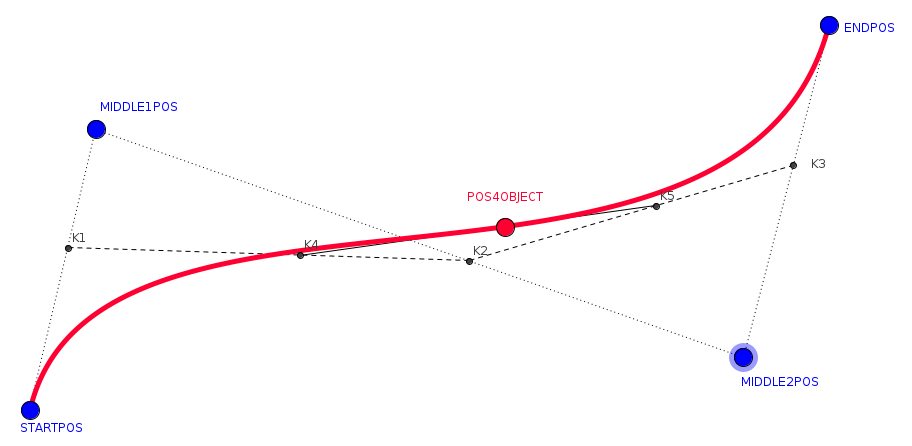

## LitSpatz4C
This repository contains examples files for the project `LitSpatz4C`.

<h3>&nbsp; &nbsp;  <a href="https://ar4nhey.github.io/litspatz4c" target="_blank">LitSpatz4C - Demo</h3>

The project uses [aframe-object-mover.js](js/aframe-object-mover.js), [Aframe](https://aframe.io) and [AR.js](https://ar-js-org.github.io/AR.js-Docs/).
For positioning single object [JSON3d4Aframe](https://niebert.github.io/JSON3D4Aframe) is used to export AR and VR examples.
  
## AR.js

The following 3D models were published by Sketchfab as Creative Commons resources.
The used marker is the Hiro-Marker that can be downloaded as [PDF](https://niebert.github.io/JSON3D4Aframe/pdf/marker_hiro_kanji_printout.pdf) from the GitHub-repository [JSON3D4Aframe](https://niebert.github.io/JSON3D4Aframe).

### Aframe / AR.js components 
* [aframe-clipping-plane-component.js](https://github.com/akbartus/A-Frame-Clipping-Plane-Component) by `akbartus` to hide animated GLB partially that are covered e.g. by a bridge
* [aframe-object-mover.js](./js/aframe-object-mover.js) by `niebert` to move Aframe objects with a [convex combination](https://en.wikiversity.org/wiki/Convex_combination) of order 1,2,3 in the 3D space. It allow scaling, rotating, hiding and displaying of 3D objects on the path.
* [ar-object-mover.js](./js/ar-object-mover.js) by `niebert` to move AR.js objects e.g on a marker with a [convex combination](https://en.wikiversity.org/wiki/Convex_combination) of order 1,2,3 in the 3D space. The library is used to move objects on a curved path in the 3D space. The library is used for the following GLB files e.g. for animating a running person in the 3D space.

### Convex Combinations and Points
The following image was created with Geogebra to show how the 2 points in between shape the curve.



### Treasure Chest

* **Browser Preview** - [HTML file - treasure_chest.html](https://ar4nhey.github.io/litspatz4c/treasure-chest-cutted.html)
* **3D-Model** - [GLB treasure_chest.glb](model3d/treasure_chest.glb)

* **[AR.js](https://ar-js-org.github.io/AR.js-Docs/)** - HTML file: [treasure-chest-cutted.html - Hiro-Marker](treasure-chest-cutted.html)

* **URL Source:**
  <https://sketchfab.com/3d-models/old-treasure-chest-82a0eebb3ab54b75b5cdd1f98544d102>

* **Licence Info** - "Treasure Chest" by Pedro Viestel is licensed under Creative Commons Attribution (<http://creativecommons.org/licenses/by/4.0/>).

### Elf Wizzard

* **Browser Preview** - [HTML file - elf\_wizard\_small.html](https://ar4nhey.github.io/litspatz4c/elf_wizard_small.html)
* **3D-Model** - [GLB elf\_wizard\_small.glb](model3d/elf_wizard_small.glb)

* **[AR.js](https://ar-js-org.github.io/AR.js-Docs/)** - HTML file: [elf\_wizard\_small.html - Hiro-Marker](elf_wizard_small.html)

* **URL Source:**
  <https://sketchfab.com/3d-models/elf-wizard-ca5564a738174feca82c9d89610c017d>

* **Licence Info** - "Elf Wizard" by Muru is licensed under Creative Commons Attribution (<http://creativecommons.org/licenses/by/4.0/>).

### Running Boy

* **Browser Preview** - [HTML file - running\_boy.html](https://ar4nhey.github.io/litspatz4c/running_boy.html)
* **3D-Model** - [GLB running\_boy.glb](model3d/running_boy.glb)

* **[AR.js](https://ar-js-org.github.io/AR.js-Docs/)** -  - HTML file: [running\_boy.html - Hiro-Marker](running_boy.html)

* **URL Source:** <https://sketchfab.com/3d-models/running-boy-cc35616b7d064559828cd99d840738f5>

* **Licence Info:** "Running boy" (<https://skfb.ly/p9ZNB>) by alexeyshadrin80 is licensed under Creative Commons Attribution (<http://creativecommons.org/licenses/by/4.0/>).

### Running Girl

* **Browser Preview** - [HTML file - mei.html](https://ar4nhey.github.io/litspatz4c/mei.html)
* **3D-Model** - [GLB mei.glb](model3d/mei.glb)

* **[AR.js](https://ar-js-org.github.io/AR.js-Docs/)** - HTML file: [mei.html - Hiro-Marker](mei.html)

* **URL Source:** <https://sketchfab.com/3d-models/mei-5478ddd14bf044e59e02bda57ec46edb>

* **Licence Info:** "Mei" by cgart.com is licensed under Creative Commons Attribution (<http://creativecommons.org/licenses/by/4.0/>).

### Wizzard Stick

* **Browser Preview** - [HTML file - wizard\_staff.html](https://ar4nhey.github.io/litspatz4c/wizard_staff.html)
* **3D-Model** - [GLB wizard\_staff.glb](model3d/wizard_staff.glb)

* **[AR.js](https://ar-js-org.github.io/AR.js-Docs/)** -  - HTML file: [wizard\_staff.html - Hiro-Marker](wizard_staff.html)

* **URL Source:** <https://sketchfab.com/3d-models/wizard-staff-873f596fb3cc44998cb75a3dce60181f>

* **License Info:**  Wizzard stick with the name "Wizard Staff" by tpbleu is licensed under Creative Commons Attribution (<http://creativecommons.org/licenses/by/4.0/>).

### Wizzard Hat

* **Browser Preview AR.js** - [HTML file - wizard\_hat\_ar\_hiro.html](https://ar4nhey.github.io/litspatz4c/wizard_hat_ar_hiro.html)
* **Browser Preview Aframe** - [HTML file - wizard\_hat\_aframe.html](https://ar4nhey.github.io/litspatz4c/wizard_hat_aframe.html)
* **Browser Preview Aframe - Move** - [HTML file - aframe\_move_wizard\_hat\_Bamberg1\_Bibliothek.html](https://ar4nhey.github.io/litspatz4c/move360/aframe_move_wizzard_hat_Bamberg1_Bibliothek.html)
* **3D-Model** - [JSON wizard\_hat\_json3d4aframe.json](model3d/wizard_hat_json3d4aframe.json) - can be modified in [JSON3D4Aframe](https://niebert.github.io/JSON3D4Aframe)
* **[AR.js](https://ar-js-org.github.io/AR.js-Docs/)** -  HTML file: [wizard\_hat\_ar\_hiro.html - Hiro-Marker](wizard_hat_ar_hiro.html)
* **[Aframe Version](https://aframe.io)** -  - HTML file: [wizard\_hat\_aframe.html - Hiro-Marker](wizard_hat_aframe.html)
* **License Info:** Creative Commons Attribution (<http://creativecommons.org/licenses/by/4.0/>) by [niebert](https://www.github.com/niebert).

### Argon Raft

* **Browser Preview** - [HTML file - argon\_raft.html](https://ar4nhey.github.io/litspatz4c/argon_raft.html)
* **3D-Model** - [GLB argon\_raft.glb](model3d/argon_raft.glb)

* **[AR.js](https://ar-js-org.github.io/AR.js-Docs/)** - HTML file: [argon\_raft.html - Hiro-Marker](argon_raft.html)

* **URL Source:**
  <https://sketchfab.com/3d-models/argon-raft-dbbf07018a534e2eab54e94d50ed5020>

* **Licence Info** - "Argon Raft" by Bar0nline is licensed under Creative Commons Attribution (<http://creativecommons.org/licenses/by/4.0/>).

### Old Treasure Chest

* **Browser Preview** - [HTML file - old\_treasure\_chest.html](https://ar4nhey.github.io/litspatz4c/old_treasure_chest.html)

* **[AR.js](https://ar-js-org.github.io/AR.js-Docs/)** - HTML file: [old\_treasure\_chest.html - Hiro-Marker](old_treasure_chest.html)

* **URL Source:** <https://sketchfab.com/3d-models/old-treasure-chest-82a0eebb3ab54b75b5cdd1f98544d102>

* **Licence Info** - "Old Treasure Chest" by PedroViestel is licensed under Creative Commons Attribution (<http://creativecommons.org/licenses/by/4.0/>).

## Moving Objects in AR.js and Aframe
Geometrical object have a reference position `(x,y,z)` in the coordinate system of the 3D space. Markers in [AR.js](https://ar-js-org.github.io/AR.js-Docs/) define the origine `(0,0,0)` of the coordinate system in the center of the marker and the size of the marker defines the unit length of the coordinate system.
Double size of the marker increases the size of object by the factor 2. To perform object movements the library [ar-object-mover.js](js/ar-object-mover.js) is used. 
* **[Moving red box](https://ar4nhey.github.io/move360/ar_move_vertical_hiro.html)** on [Hiro Marker] - [Source File](move360/ar_move_vertical_hiro.html)

### Header of HTML File AR Object Mover
The library [ar-object-mover.js](js/ar-object-mover.js) uses [convex combination of order 2](https://en.wikiversity.org/wiki/Convex_combination#Bernstein_polynomial_-_order_2) to create a bended track between a starting point `A` and an end point `B`. A middle point `H1` is used to bend the track. In the following example
* `A=(-4, -5, 1)` is used as starting point,
* `B=(+4, -5, 1)` is used as end point and
* `H1=(0, -3, -3)` is used as middle point to bend the track,

```html
<!DOCTYPE html>
<html>
<head>
  <meta charset="UTF-8">
  <meta name="viewport" content="width=device-width, initial-scale=1.0">
  <title>AR.js - move - box - hiro</title>
  <script src="../js/aframe.min.js"></script>
  <script src="../js/aframe-ar.js"> </script>
  <script src="../js/aframe-extras.js"></script>
  <script src="../js/ar-object-mover.js"></script>
  <script>
          // Include the ObjectMover class
          // Create an instance of ObjectMover for the box
          const boxMover = new ARMover('movingbox','ar');
          // Standard flat position of hiro marker    
          // Set start and end positions (x,y,z)
          // x: -left/+right
          // y: -down/+up
          // z: -rear/+front

          // Vertical position of hiro marker    
          // x: -left/+right
          // y: -rear/+front
          // z: -down/+up
          
          boxMover.setStartPosition(-4, -5, 1);
          boxMover.setMiddlePosition(0, -3, -3);
  		    boxMover.setEndPosition(+4, -5, 1);
  		    boxMover.setLoop(true);
          // Set start and end rotations - no rotation
          boxMover.setStartRotation(0, 0, 0);
          boxMover.setEndRotation(0, 4, 0);

          // Set duration
          boxMover.setDuration(8000); // duration of path 8 seconds

          // Start the movement
          boxMover.startMovement();
</script>
```
### Assign a Movement to a Aframe/AR entity
The above code generates a box mover called `movingbox` with the given properties of starting point, end point and middle point for [bending the curve as convex combination of order 2](https://en.wikiversity.org/wiki/Convex_combination#Bernstein_polynomial_-_order_2). Convex combination of order 1 is a straight line as track. Second order allow bended tracks. Now we assign the track to a specific entity (red box).
```html
<body style="margin : 0px; overflow: hidden;">
  <a-scene embedded arjs>
  <a-marker preset="hiro">
    <a-box id="redBox" movingbox  size="3 0.5 1"  color="red" material="opacity:0.7"></a-box>
    <a-box id="blueBox"  position="0 0 0"  size="1 1 1"  color="blue" material="opacity:0.7"></a-box>
  </a-marker>
  <a-entity camera></a-entity>
  </a-scene>
</body>
</html>
```
We assigned to object with the ID `redBox` the attribute `movingbox`. This makes the object move on the given track. The blue box with the ID `blueBox` is static in the Aframe scene, because the object mover `movingbox` was not assigned to that entity. The [live example](https://ar4nhey.github.io/litspatz4c/move360/ar_move_box_vertical_hiro.html)

### Aframe Object Mover
For moving objects in the 3D space in [Aframe](https://aframe.io) or [AR.js](https://ar-js-org.github.io/AR.js-Docs/) this library contains a library `aframe-object-mover.js` stored in the Javascript folder `js/`. An instance of the object mover is responsible for moving an object from location `(x1,y1,z1)` as start position to a location `(x2,y2,z2)` as the end position. As a route a straight line is used and mathematical implemented as a [convex combination](https://en.wikiversity.org/wiki/Convex_combination#Bernstein_polynomial_-_order_2)).

### Moving Box
* **Browser Preview** - [Moving Box](https://ar4nhey.github.io/litspatz4c/move360/ar_move_box_hiro.html)
* **Marker:** Hiro marker
* **Start Position:** ()
* **End Position:** ()
* **Loop:** true
* **[AR.js](https://ar-js-org.github.io/AR.js-Docs/)** -  - HTML file: [moving_box.html - Hiro-Marker](wizard_staff.html)

### Roting Box
* **Browser Preview** - [Moving Box](https://ar4nhey.github.io/litspatz4c/move360/ar_rotate_thiro.html)
* **Marker:** Hiro marker
* **Rotation Angles:** () x-axis, y-axis, z-axis in degrees
* **Loop:** true
* **[AR.js](https://ar-js-org.github.io/AR.js-Docs/)** -  - HTML file: [move360/ar_rotate_box_hiro.html - Hiro-Marker](move360/ar_rotate_box_hiro.html)

### Moving and Roting Box
* **Browser Preview** - [Moving and Rotating Box](https://ar4nhey.github.io/litspatz4c/move360/ar_move_rotate_box_hiro.html)
* **Marker:** Hiro marker
* **Start Position:** ()
* **End Position:** ()
* **Rotation Angles:** () x-axis, y-axis, z-axis in degrees
* **Loop:** true
* **[AR.js](https://ar-js-org.github.io/AR.js-Docs/)** -  - HTML file: [move360/ar_move_rotate_box_hiro.html - Hiro-Marker](move360/ar_move_rotate_box_hiro.html)

## Embedding of 3D Models with AR.js

### Used Marker

The used marker for the 3D models is the [Hiro marker](https://niebert.github.io/JSON3D4Aframe/pdf/marker_hiro_kanji_printout.pdf). The definition of the marker in the HTML code is done with the `a-marker` tag an the preset definition for the [Hiro marker](https://niebert.github.io/JSON3D4Aframe/pdf/marker_hiro_kanji_printout.pdf):

```html
<a-marker preset="hiro">
```

### Entity Tag for 3D model

The following `entity` tag embeds the 3D model

```html
<a-entity
      position="0 0 0"
      rotation="0 90 0"
      scale="2.0 2.0 2.0"
      animation-mixer="loop: repeat"
      gltf-model="./model3d/elf_wizard_small.glb"
      ></a-entity>
```

### Pathname to 3D Model

The 3D model is a GLB file `elf_wizard_small.glb` located in the subdirectory `model3d/`. The attribute `gltf-model` is used to specify the pathname.

```html
<a-entity  
    ...
    gltf-model="./model3d/elf_wizard_small.glb"
   ></a-entity>
```

### Position of the 3D Model

Position of the 3D model on the marker is defined by (x,y,z) coordinates.

* x-axis is left(-) right(+),

* y-axis is up(+) down(-),

* z-axis is foreground (+) background(-)
  with reference to the origin (0,0,0). With the following position the 3D model is placed at the origin over the marker.

```html
<a-entity
    ...
    position="0 0 0"
    ...
   ></a-entity>
```

### Rotation of the 3D Model

Rotation of the 3D model around the x-axis, y-axis and z-axis is defined by the following tag attribute. y-axis rotation with 90 degress is defined by the following angles:

```html
<a-entity
    ...
    rotation="0 90 0"
    ...
   ></a-entity>
```

### Size of the 3D Model

Scaling of the 3D model can be performed for the x-axis, y-axis and z-axis seperately. So you need to specify 3 values that in general equal to have the aspect ratio preserved in the scaled model.
Especially the 3D model `running_boy.glb` was very small on the marker and was visible just as a dot. So scaling was necessary with a scale factor of 120 for the x-axis, y-axis and z-axis with:

```html
<a-entity
    ...
    scale="120.0 120.0 120.0"
    ...
   ></a-entity>
```

In general unscaled models will have the settings for the scale factor `1.0`

```html
<a-entity
    ...
    scale="1.0 1.0 1.0"
    ...
   ></a-entity>
```

In following setting with scale the width by the factor 3.0, the height of the model by the factor `2.0` and the depth of the vector remains unchanged with the scale factor `1.0`

```html
<a-entity
    ...
    scale="3.0 2.0 1.0"
    ...
   ></a-entity>
```

## Folders

* `index.html` is the main starting page of the repository that contains links to all HTML files available in this repository.

* The directory `model3d/` contains all 3D models of the repository, that are listed above.

* all 3D models have a correponding HTML file with the same base name.  E.g. the 3D model `elf_wizard_small.glb` in the folder `model3d/` has the corresponding HTML file `elf_wizard_small.html` that is used to display the 3D model in the browser.

* The directory `js/` contains all Javascript sources required for the showing animated GLB files in a browser with [AR.js](https://ar-js-org.github.io/AR.js-Docs/).

## Usage on a Web Server

Copy the models with the folders `js/` and `model3d/` in folder of you web server (e.g. <https://www.example.com>). If the content is available in the subdirectory `mymodels/` of the server root directory, then you `index.html` will be available under the URL <https://www.example.com/mymodels/index.html> .

## Modification of 3D Models

To modify existing models in the folder `model3d/` it is recommended to
use the Open Source software
[Blender](https://www.blender.org/download/).

* If you are a novice start with a [Blender Cup tutorial](https://www.youtube.com/watch?v=anG15t4od80)

* [Tutorial: Blender MODELLING For Absolute Beginners - Simple Human](https://www.youtube.com/watch?v=9xAumJRKV6A)

* [How to make a Character in Blender - My Full Process in 10 Minutes](https://www.youtube.com/watch?v=TumrA0XsX0A)

* [Rigging - Bones of Character - Animation](https://www.youtube.com/watch?v=m-Obo_nC3SM)

